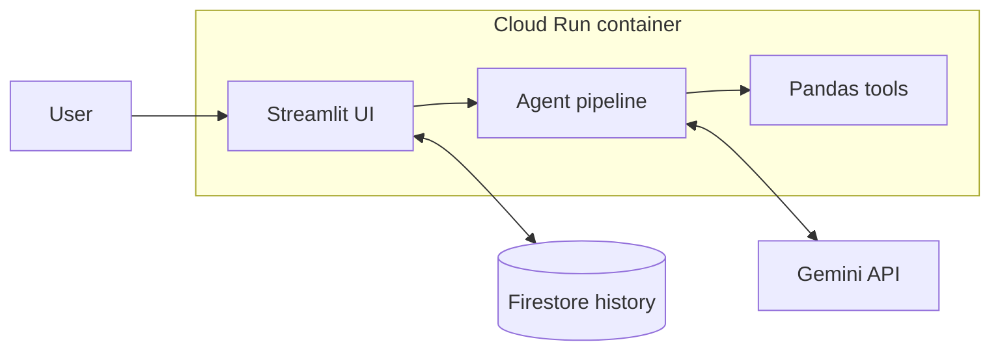

# DataPilot AI

> **Upload data. Ask questions. Let an AI agent analyze it.**

An agentic AI data analyst: upload a CSV, ask a question in plain English, and get an answer, key metrics, insights and a recommendation. **Pandas does every calculation. Gemini only explains the results.**

## Overview

DataPilot AI is a small, complete portfolio project built with Python, Streamlit, Pandas, the Google Gemini API, Firebase Firestore, Docker and Google Cloud Run. It is deliberately focused: a few well-tested analysis types rather than "answer anything".

## Problem Statement

Business users have CSV files but not the time or skills to write Pandas code. Generic chatbots can explain data, but they also **hallucinate numbers**, which is unacceptable for analysis.

## Solution

A multi-step agent separates **computation** from **explanation**:

- **Computation** → Python / Pandas (exact, reproducible numbers)
- **Explanation** → Gemini (clear language, insights, recommendations), fed only with the computed results

If a question can't be answered safely from the data, the app says so:
*"I couldn't answer this question using the available dataset."*

## Features

- CSV upload with automatic type detection (dates, numbers such as `$1,200`)
- Dataset overview: rows, columns, column names, missing values, preview
- Natural-language questions with a transparent, step-by-step agent workflow
- Answer, key metrics, supporting tables, 2–4 insights and a recommendation
- Analysis history saved to Firebase Firestore (with a session fallback if Firestore is unavailable)
- Clear error handling: empty or invalid CSV, missing columns, unsupported questions, Gemini and Firestore failures
- Works without a Gemini key (computed summary only), so the Pandas engine is always testable
- Docker image ready for Google Cloud Run

## Agentic AI Architecture

```
USER QUESTION
      ↓
QUESTION ANALYZER   (agents/question_analyzer.py)  understand intent, metric, grouping, filters
      ↓
ANALYSIS PLANNER    (agents/planner.py)            choose the Pandas tool and describe the plan
      ↓
RESULT VALIDATOR    (agents/validator.py)          check columns exist, question is supported
      ↓
DATA ANALYSIS TOOL  (agents/analyst.py)            Pandas runs the calculation
      ↓
RESULT VALIDATOR                                    check the output is valid and finite
      ↓
GEMINI EXPLANATION  (agents/explainer.py)          answer + insights + recommendation
      ↓
FINAL RESPONSE
```

| Component | Role |
|---|---|
| Question Analyzer | Uses Gemini to turn the question into a structured request, with a deterministic keyword fallback |
| Planner | Maps the request to one tool: scalar, group aggregate, share, trend, outliers, describe, or insights |
| Analyst | Pure Pandas. The LLM never produces numbers |
| Validator | Rejects unsupported questions and missing or non-numeric columns before running, and bad results after |
| Explainer | Gemini explains the computed result under a "use only these numbers" prompt |

## Technology Stack

Python 3.11 · Streamlit · Pandas · Google Gemini API (`google-genai`) · Firebase Firestore · Docker · Google Cloud Run · Git & GitHub

## System Architecture



## Project Structure

```
DataPilot-AI/
├── app.py                      # Streamlit UI + agent orchestration
├── agents/
│   ├── question_analyzer.py
│   ├── planner.py
│   ├── analyst.py
│   ├── validator.py
│   └── explainer.py
├── services/
│   ├── gemini_service.py
│   └── firestore_service.py
├── utils/
│   ├── data_loader.py
│   └── data_analysis.py
├── sample_data/sales.csv
├── requirements.txt
├── Dockerfile
├── .dockerignore
├── .gitignore
├── .env.example
├── README.md
└── LICENSE
```

## How It Works

1. Upload a CSV (or load the sample dataset).
2. Ask a question, e.g. *"Which region performed best?"*
3. The **Question Analyzer** identifies the task: highest region by Revenue.
4. The **Planner** builds: *Group by Region → Total Revenue → Sort descending → Take the first row*.
5. The **Validator** confirms `Region` and `Revenue` exist and `Revenue` is numeric.
6. **Pandas** computes the result.
7. The **Validator** checks the result is valid.
8. **Gemini** explains it in plain language, with insights and a recommendation.
9. The analysis is saved to Firestore and appears under **History**.

Open **How the Agent Worked** under any answer to see every step.

## Example Questions

- What is the total sales?
- Which product has the highest sales?
- Which region performed best?
- What is the average revenue?
- What percentage of sales came from each category?
- Which month had the highest revenue?
- Show the top 5 products.
- What are the most important trends?
- Are there any unusual values?
- Give me three business insights from this dataset.
- What is the total revenue in the North region?

Out of scope: forecasts, causal "why" questions, joins across files and anything needing columns that don't exist.

## Screenshots

> Add screenshots after running the app and save them under `docs/screenshots/`.

| Home | Answer | Agent workflow | History |
|---|---|---|---|
|  |  |  |  |

## Local Setup

```bash
git clone https://github.com/<your-username>/DataPilot-AI.git
cd DataPilot-AI

python -m venv .venv
source .venv/bin/activate        # Windows: .venv\Scripts\activate
pip install -r requirements.txt

cp .env.example .env             # then edit .env and add your GEMINI_API_KEY
streamlit run app.py
```

Get a Gemini API key from [Google AI Studio](https://aistudio.google.com/apikey). For Firestore history locally, run `gcloud auth application-default login` and set `GOOGLE_CLOUD_PROJECT` in `.env`. Without it the app still works and keeps history for the current session only.

**Run with Docker locally**

```bash
docker build -t datapilot-ai .
docker run --rm -p 8080:8080 --env-file .env datapilot-ai
# open http://localhost:8080
```

## Google Cloud Deployment

Replace `PROJECT_ID` and pick your region (`asia-south1` = Mumbai is used below).

**1. Create a Google Cloud project**
```bash
gcloud projects create PROJECT_ID           # or reuse an existing project
gcloud config set project PROJECT_ID
```
Enable billing for the project in the Cloud Console.

**2. Enable required services**
```bash
gcloud services enable run.googleapis.com cloudbuild.googleapis.com \
  artifactregistry.googleapis.com firestore.googleapis.com secretmanager.googleapis.com
```

**3. Configure the Gemini API**
Create an API key in [Google AI Studio](https://aistudio.google.com/apikey). Store it in Secret Manager so it never appears in code or images:
```bash
printf "YOUR_KEY" | gcloud secrets create gemini-api-key --data-file=-
```

**4. Configure Firestore** (see the next section)

**5. Build the Docker image**
```bash
gcloud artifacts repositories create datapilot --repository-format=docker --location=asia-south1
gcloud builds submit --tag asia-south1-docker.pkg.dev/PROJECT_ID/datapilot/datapilot-ai
```

**6. Deploy to Cloud Run**
```bash
gcloud run deploy datapilot-ai \
  --image asia-south1-docker.pkg.dev/PROJECT_ID/datapilot/datapilot-ai \
  --region asia-south1 \
  --allow-unauthenticated \
  --port 8080 \
  --set-secrets GEMINI_API_KEY=gemini-api-key:latest \
  --set-env-vars GOOGLE_CLOUD_PROJECT=PROJECT_ID
```
The container reads Cloud Run's `PORT` variable: the Dockerfile starts Streamlit with `--server.port=${PORT}`. Cloud Run sets it automatically (default 8080).

**7. Grant access**
The Cloud Run service account needs permission for Firestore and for the secret:
```bash
SA=$(gcloud run services describe datapilot-ai --region asia-south1 --format='value(spec.template.spec.serviceAccountName)')
gcloud projects add-iam-policy-binding PROJECT_ID --member="serviceAccount:$SA" --role="roles/datastore.user"
gcloud secrets add-iam-policy-binding gemini-api-key --member="serviceAccount:$SA" --role="roles/secretmanager.secretAccessor"
```
(For a quick demo you can skip Secret Manager and use `--set-env-vars GEMINI_API_KEY=...` instead.)

**8. Open the deployed application**
`gcloud run deploy` prints a `https://datapilot-ai-xxxxx.a.run.app` URL. Open it and try the sample dataset.

> `--allow-unauthenticated` makes the app public and every visitor spends your Gemini quota. Remove it and use IAM or add authentication for anything beyond a demo.

## Firestore Setup

1. Create a Firestore database in **Native mode**. Choose the location carefully, because it can't be changed later:
   ```bash
   gcloud firestore databases create --location=asia-south1
   ```
2. No schema or index setup is needed. The app writes to a collection named `analysis_history`, one document per analysis:

| Field | Type |
|---|---|
| `timestamp` | timestamp (UTC) |
| `user_question` | string |
| `dataset_name` | string |
| `analysis_type` | string (e.g. `top_group`, `trend`) |
| `answer` | string |
| `insights` | array of strings |
| `recommendation` | string |

3. Authentication uses Application Default Credentials. On Cloud Run that is the service account (step 7). Locally use `gcloud auth application-default login`. No credential files are committed.

**Limitation:** the MVP has no user authentication, so history is shared by everyone using the same deployment.

## Environment Variables

| Variable | Required | Description |
|---|---|---|
| `GEMINI_API_KEY` | Yes (for AI explanations) | Gemini API key. Never commit it |
| `GEMINI_MODEL` | No | Model name, default `gemini-2.5-flash`. Change it if Google retires that name |
| `GOOGLE_CLOUD_PROJECT` | No | GCP project for Firestore (auto-detected on Cloud Run) |
| `FIRESTORE_DATABASE` | No | Firestore database id, default `(default)` |
| `PORT` | No | Set by Cloud Run; default 8080 |

`.env` is in `.gitignore` and `.dockerignore`. Only `.env.example` is committed.

## Sample Dataset

`sample_data/sales.csv`: 293 orders across calendar year 2025 with columns `Date, Product, Category, Region, Quantity, Unit_Price, Revenue`.

- 8 products in 3 categories (Electronics, Furniture, Stationery) and 4 regions
- Seasonal pattern with a strong Q4 and a weak February, for trend questions
- Two deliberate bulk orders (a Standing Desk order in March, a Laptop order in July) so "unusual values" has something to find

## Future Improvements

- Multiple file support
- SQL database support
- Automatic visualization generation
- More specialized agents
- Authentication
- Scheduled reports
- Cloud Storage integration

## Author

**Varun Kumar Kesineni**

Data Analytics | Data + AI | Generative AI
