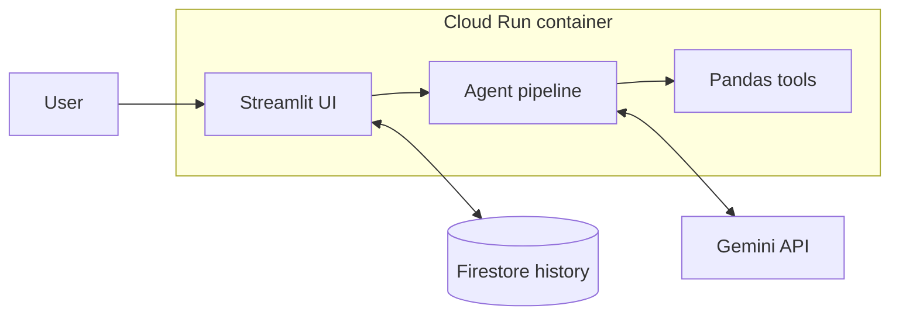
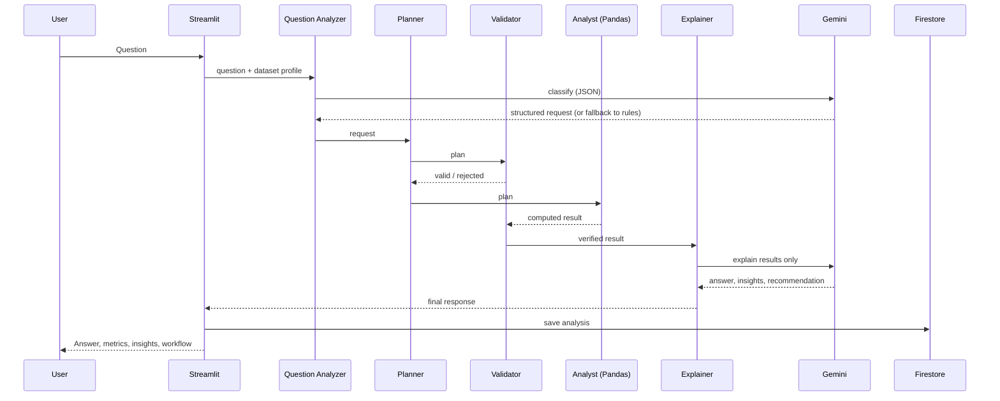

# DataPilot AI - Agentic Data Analyst

> **Upload data. Ask questions. Let an AI agent analyze it.**


---

## Table of Contents

1. [Overview](#1-overview)
2. [Problem Statement](#2-problem-statement)
3. [Solution](#3-solution)
4. [Features](#4-features)
5. [Agentic AI Architecture](#5-agentic-ai-architecture)
6. [Supported Analyses](#6-supported-analyses)
7. [Technology Stack](#7-technology-stack)
8. [System Architecture](#8-system-architecture)
9. [Project Structure](#9-project-structure)
10. [How It Works (End to End)](#10-how-it-works-end-to-end)
11. [Design Decisions](#11-design-decisions)
12. [Data Handling and Validation](#12-data-handling-and-validation)
13. [Error Handling](#13-error-handling)
14. [Example Questions](#14-example-questions)
15. [Local Setup](#16-local-setup)
16. [Testing and Quality Checklist](#17-testing-and-quality-checklist)
17. [Firestore Setup](#18-firestore-setup)
18. [Google Cloud Run Deployment](#19-google-cloud-run-deployment)
19. [Publishing to GitHub](#20-publishing-to-github)
20. [Environment Variables](#21-environment-variables)
21. [Security and Cost Notes](#22-security-and-cost-notes)
22. [Sample Dataset](#23-sample-dataset)
23. [Troubleshooting](#24-troubleshooting)
24. [Limitations](#25-limitations)
25. [Future Improvements](#26-future-improvements)
26. [Author](#27-author)

---

## 1. Overview

DataPilot AI is an end-to-end **agentic AI data analyst**. A user uploads a CSV file, asks a question in plain English, and receives an **answer, key metrics, supporting tables, insights and a recommendation**.

It is built as a small but complete portfolio project: a working Streamlit application, a multi-step agent workflow, persistent analysis history in Firebase Firestore, and a containerized deployment on Google Cloud Run.

The central idea is a strict separation of responsibilities:

| Responsibility | Handled by |
|---|---|
| **Computation** (exact numbers) | Python / Pandas |
| **Explanation** (language, insights, recommendations) | Google Gemini |

The language model never calculates anything. It only explains results that Pandas has already computed.

## 2. Problem Statement

Business users often hold data in CSV files but lack the time or skills to write analysis code. General-purpose chatbots can discuss data, but they can also **invent numbers**, which is unacceptable when decisions depend on the answer.

## 3. Solution

DataPilot AI uses a small agent pipeline instead of a single chatbot prompt:

1. The question is converted into a **structured analysis request**.
2. A **planner** selects the right Pandas tool.
3. A **validator** confirms the request is supported by the dataset.
4. **Pandas** performs the calculation.
5. The result is **validated again** (finite values, non-empty tables).
6. **Gemini** explains the verified result in clear language.

If a question cannot be answered safely from the data, the application responds with:

> *"I couldn't answer this question using the available dataset."*

## 4. Features

- **CSV upload** with automatic type detection (dates, and numbers such as `$1,200` or `45%`)
- **Dataset overview:** row count, column count, column names, missing-value count, data preview
- **Natural-language questions** with a transparent, step-by-step agent workflow
- **Structured results:** answer, key metrics, supporting tables, 2–4 insights, recommendation
- **Analysis history** saved to Firebase Firestore, with a session-only fallback if Firestore is unavailable
- **"How the Agent Worked"** panel showing every pipeline step for each answer
- **Graceful degradation:** works without a Gemini key (shows the computed summary only)
- **Defensive error handling** for empty or invalid files, missing columns, unsupported questions, Gemini failures and Firestore failures
- **Secrets never hardcoded:** configuration through environment variables, `.env` excluded from Git and Docker
- **Container-ready:** Docker image that honors Cloud Run's `PORT` variable and runs as a non-root user

## 5. Agentic AI Architecture

```text
USER QUESTION
      │
      ▼
QUESTION ANALYZER      agents/question_analyzer.py
      │                understand intent, metric, grouping, filters
      ▼
ANALYSIS PLANNER       agents/planner.py
      │                choose the Pandas tool, describe the plan
      ▼
RESULT VALIDATOR       agents/validator.py   (pre-check)
      │                columns exist? numeric? question supported?
      ▼
DATA ANALYSIS TOOL     agents/analyst.py
      │                Pandas performs the calculation
      ▼
RESULT VALIDATOR       agents/validator.py   (post-check)
      │                finite metrics? non-empty tables?
      ▼
GEMINI EXPLANATION     agents/explainer.py
      │                answer + insights + recommendation
      ▼
FINAL RESPONSE
```

| Component | Responsibility |
|---|---|
| **Question Analyzer** | Uses Gemini to turn the question into a structured request (intent, metric, group-by, aggregation, order, top-N, filters). Falls back to a deterministic keyword analyzer if Gemini is unavailable or returns something invalid. |
| **Planner** | Maps the request to exactly one tool and produces a human-readable plan such as *Group by Region → Total Revenue → Sort descending → Take the first row*. |
| **Validator (pre)** | Rejects unsupported questions, references to columns that do not exist (for example "profit"), non-numeric metrics, and missing date columns. |
| **Analyst** | Pure Pandas. Executes the plan and returns metrics, tables, a deterministic summary and factual highlights. |
| **Validator (post)** | Checks that the result has a summary, finite numeric metrics and non-empty tables. |
| **Explainer** | Gemini receives the computed result under a "use only these numbers, never calculate" prompt and returns the answer, insights and recommendation. If it fails, the deterministic summary is shown instead. |

## 6. Supported Analyses

| Intent | Example question | What Pandas does |
|---|---|---|
| `total` | What is the total sales? | Sum of the metric (optionally per group) |
| `average` | What is the average revenue? | Mean of the metric (optionally per group) |
| `top_group` | Which region performed best? | Group, aggregate, sort, take the first row |
| `ranking` | Show the top 5 products | Group, aggregate, sort, keep top or bottom N |
| `share` | What percentage of sales came from each category? | Group sum divided by overall total × 100 |
| `trend` | What are the most important trends? | Monthly totals, period-over-period change, direction, peak and low |
| `outliers` | Are there any unusual values? | IQR rule: flag values outside 1.5 × IQR |
| `describe` | Describe the dataset | Count, mean, std, min, quartiles, max for numeric columns |
| `insights` | Give me three business insights | Totals and averages, share by main categories, monthly trend, outlier check |
| `unsupported` | Predict next year's sales | Rejected with a clear message |

Additional capabilities:

- **Time grouping:** "Which month…" and "…per year" group by calendar month or year when a date column exists.
- **Equality filters:** "What is the total revenue in the North region?" filters `Region = North` before aggregating.
- **Ascending or descending order:** words such as *lowest*, *worst*, *bottom* reverse the sort.

## 7. Technology Stack

| Layer | Technology |
|---|---|
| Language | Python 3.11 |
| UI | Streamlit |
| Data analysis | Pandas, NumPy |
| LLM | Google Gemini API (`google-genai` SDK) |
| Database | Firebase Firestore (`google-cloud-firestore`) |
| Config | `python-dotenv` |
| Container | Docker (`python:3.11-slim`) |
| Hosting | Google Cloud Run |
| Version control | Git and GitHub |

## 8. System Architecture



**Request sequence**



## 9. Project Structure

```text
DataPilot-AI/
├── app.py                      # Streamlit UI and agent orchestration
├── agents/
│   ├── question_analyzer.py    # question → structured request (Gemini + rules)
│   ├── planner.py              # request → tool + readable plan
│   ├── analyst.py              # runs the Pandas tool
│   ├── validator.py            # pre- and post-analysis checks
│   └── explainer.py            # Gemini explanation with safe fallback
├── services/
│   ├── gemini_service.py       # Gemini client wrapper (JSON output, timeout)
│   └── firestore_service.py    # save, read and clear analysis history
├── utils/
│   ├── data_loader.py          # CSV parsing and type inference
│   └── data_analysis.py        # pure Pandas computation functions
├── sample_data/
│   └── sales.csv               # 293-row demo dataset
├── requirements.txt
├── Dockerfile
├── .dockerignore               # keeps .env out of the image
├── .gitignore                  # keeps .env out of Git
├── .env.example                # template, no secrets
├── README.md
└── LICENSE
```

## 10. How It Works (End to End)

1. **Upload** a CSV (or click *Use sample dataset*).
2. **Load and profile:** the file is parsed, types are inferred, columns are classified as numeric, datetime or categorical.
3. **Ask** a question, for example *"Which region performed best?"*
4. **Understand:** the Question Analyzer produces `intent=top_group, metric=Revenue, group_by=Region`.
5. **Plan:** *Group by Region → Total Revenue → Sort descending → Take the first row*.
6. **Pre-validate:** `Region` and `Revenue` exist and `Revenue` is numeric.
7. **Compute:** Pandas groups, sums and sorts.
8. **Post-validate:** metrics are finite and the table is not empty.
9. **Explain:** Gemini turns the verified numbers into an answer, 2–4 insights and a recommendation.
10. **Display:** Answer, Key Metrics, supporting tables, Insights, Recommendation, and the *How the Agent Worked* panel.
11. **Persist:** successful analyses are saved to Firestore and listed in the **History** tab and sidebar.

## 11. Design Decisions

| Decision | Reasoning |
|---|---|
| **Pandas computes, Gemini explains** | Eliminates hallucinated numbers. Every figure is reproducible. |
| **Gemini classifies into a closed set of intents** | Constrains the model to known-safe operations instead of free-form code generation. No LLM-written code is ever executed. |
| **Rule-based fallback analyzer** | The app keeps working without an API key or during Gemini outages, and the Pandas engine can be tested in isolation. |
| **Two-stage validation** | Catches unsupported questions and missing columns before computing, and invalid output after. |
| **Deterministic summary alongside the AI answer** | If Gemini fails, users still get a correct, number-accurate answer. |
| **Unsupported questions are not saved to history** | Keeps history meaningful. |
| **Session-history fallback** | Firestore problems never break the main workflow. |
| **No authentication in the MVP** | Keeps scope realistic for a mini project (see [Limitations](#25-limitations)). |

## 12. Data Handling and Validation

**Loading**

- Accepts `.csv` uploads; tries UTF-8 (with BOM) first, then Latin-1.
- Drops fully empty rows and columns.
- Rejects empty files, unparseable files, files with no usable rows, and duplicate column names.
- Caps analysis at **200,000 rows**.

**Type inference**

- A text column becomes a **date** if its name contains `date` or `time`, or its values look like `YYYY-MM-DD`, and at least 80% of values parse.
- A text column becomes **numeric** if at least 80% of values parse after removing `, $ ₹ € £ %` and whitespace.
- Columns that stay text are treated as **categorical**.

**Validation rules**

- The metric must exist and be numeric, with at least one valid value.
- Group-by columns must exist; month and year grouping require a date column.
- Questions naming a measure that is not in the data (for example *profit*, *cost*, *margin*) are rejected with the list of available numeric columns.
- Shares require a positive total.
- Trends require at least two time periods.
- Outlier detection requires at least four values.

## 13. Error Handling

| Situation | Behavior |
|---|---|
| No CSV uploaded | Informational prompt to upload a file or use the sample |
| Empty CSV | "The uploaded CSV file is empty." |
| Invalid or unparseable CSV | Clear parsing error, no crash |
| Missing columns | Message listing the numeric columns that are available |
| Missing values | Counted and shown; ignored in calculations; reported in outlier analysis |
| Invalid numeric data | Column stays text; the validator explains that no numeric column is available |
| Unsupported question | "I couldn't answer this question using the available dataset." plus the reason |
| Gemini unavailable or invalid response | Computed summary shown with a short notice |
| Gemini key missing | Sidebar warning; app still computes answers |
| Firestore unavailable | Warning shown; history kept for the current session |

Error messages never include API keys or credentials.

## 14. Example Questions

- What is the total sales?
- Which product has the highest sales?
- Which region performed best?
- What is the average revenue?
- What percentage of sales came from each category?
- Which month had the highest revenue?
- Show the top 5 products.
- What are the most important trends?
- Are there any unusual values?
- Give me three business insights from this dataset.
- What is the total revenue in the North region?
- Which product category has the lowest revenue?
- Show the bottom 3 regions by quantity.
- What is the average revenue by region?

**Out of scope:** forecasting, causal "why" questions, joins across files, and anything that needs columns that do not exist.

## 15. Local Setup

**Prerequisites:** Python 3.11+, Git, and (optionally) Docker and the Google Cloud CLI.

### Windows (Command Prompt)

Run each line separately and do not paste comments.

```bat
git clone https://github.com/your-username/DataPilot-AI.git
cd DataPilot-AI
python -m venv .venv
.venv\Scripts\activate
pip install -r requirements.txt
copy .env.example .env
notepad .env
streamlit run app.py
```

### macOS / Linux

```bash
git clone https://github.com/your-username/DataPilot-AI.git
cd DataPilot-AI
python3 -m venv .venv
source .venv/bin/activate
pip install -r requirements.txt
cp .env.example .env
nano .env
streamlit run app.py
```

In `.env`, replace the placeholder with your real key from [Google AI Studio](https://aistudio.google.com/apikey):

```env
GEMINI_API_KEY="XX.XXXXXXb8RN6Jd-HFblgEf1trsg3PaTLRYgSoXXXXXXXXXXXXXXXXX-xxx"
```

The app opens at **http://localhost:8501**.

**Optional: Firestore history locally**

```bash
gcloud auth login
gcloud auth application-default login
```

Add `GOOGLE_CLOUD_PROJECT=your-project-id` to `.env`. Without this, the app still works and keeps history for the current session only.

**Run with Docker locally**

```bash
docker build -t datapilot-ai .
docker run --rm -p 8080:8080 --env-file .env datapilot-ai
```

Open **http://localhost:8080**. Firestore will show a warning locally because the container has no Google credentials; this is resolved on Cloud Run by the service account.

## 16. Testing and Quality Checklist

Run through this list before publishing.

**Functional**

- [ ] Sample dataset loads: 293 rows, 7 columns, 0 missing values
- [ ] At least five example questions return correct answers (see expected values below)
- [ ] "How the Agent Worked" shows five steps
- [ ] History tab shows saved analyses; sidebar shows recent questions
- [ ] Clear history empties both the sidebar and Firestore

**Failure handling**

- [ ] `Predict next year's sales` returns the unsupported message
- [ ] An empty CSV shows an "empty file" error
- [ ] A CSV with no numeric columns shows a "no numeric column" message
- [ ] A wrong `GEMINI_API_KEY` still returns the computed answer plus a notice
- [ ] Running without Firestore credentials shows a warning but does not crash

**Deployment and hygiene**

- [ ] `docker build` and `docker run` succeed locally
- [ ] Cloud Run service opens and answers questions
- [ ] History persists in Firestore from the deployed app
- [ ] `git status` does **not** list `.env`
- [ ] No secrets appear in the repository or the Docker image

**Expected results on the bundled `sample_data/sales.csv`**

| Question | Expected answer |
|---|---|
| Total sales | 349,717.88 |
| Average revenue | 1,193.58 |
| Highest-revenue product | Laptop (100,457.20) |
| Best region | West (137,507.33) |
| Category shares | Electronics 71.4%, Stationery 10.7% (Furniture is the remainder) |
| Highest-revenue month | 2025-07 (71,139.07) |
| Top 5 products | Laptop, Smartphone, Headphones, Office Chair, Standing Desk |
| Unusual values | 25 rows flagged by the IQR rule |

## 17. Firestore Setup

1. Create a Firestore database in **Native mode**. The location cannot be changed afterwards.

   ```bash
   gcloud firestore databases create --location=asia-south1
   ```

2. No schema or index setup is required. The app writes to the `analysis_history` collection, one document per successful analysis:

   | Field | Type |
   |---|---|
   | `timestamp` | timestamp (UTC) |
   | `user_question` | string |
   | `dataset_name` | string |
   | `analysis_type` | string (for example `top_group`, `trend`) |
   | `answer` | string |
   | `insights` | array of strings |
   | `recommendation` | string |

3. Authentication uses **Application Default Credentials**. On Cloud Run this is the service account; locally use `gcloud auth application-default login`. No credential files are committed to the repository.

## 18. Google Cloud Run Deployment

Replace `PROJECT_ID` with your project ID. `asia-south1` (Mumbai) is used as the region.

### Step 1 — Create the project and enable billing

```bash
gcloud auth login
gcloud projects create PROJECT_ID
gcloud config set project PROJECT_ID
```

Link a billing account to the project in the Cloud Console.

### Step 2 — Enable required services

```bash
gcloud services enable run.googleapis.com cloudbuild.googleapis.com artifactregistry.googleapis.com firestore.googleapis.com secretmanager.googleapis.com
```

### Step 3 — Create Firestore

```bash
gcloud firestore databases create --location=asia-south1
```

### Step 4 — Store the Gemini key in Secret Manager

```bash
printf "YOUR_REAL_KEY" | gcloud secrets create gemini-api-key --data-file=-
```

### Step 5 — Grant permissions (before deploying)

```bash
PROJECT_NUMBER=$(gcloud projects describe PROJECT_ID --format="value(projectNumber)")
SA=${PROJECT_NUMBER}-compute@developer.gserviceaccount.com

gcloud projects add-iam-policy-binding PROJECT_ID --member="serviceAccount:$SA" --role="roles/datastore.user"
gcloud secrets add-iam-policy-binding gemini-api-key --member="serviceAccount:$SA" --role="roles/secretmanager.secretAccessor"
```

### Step 6 — Build the Docker image

```bash
gcloud artifacts repositories create datapilot --repository-format=docker --location=asia-south1
gcloud builds submit --tag asia-south1-docker.pkg.dev/PROJECT_ID/datapilot/datapilot-ai
```

### Step 7 — Deploy to Cloud Run

```bash
gcloud run deploy datapilot-ai \
  --image asia-south1-docker.pkg.dev/PROJECT_ID/datapilot/datapilot-ai \
  --region asia-south1 \
  --service-account $SA \
  --allow-unauthenticated \
  --port 8080 \
  --set-secrets GEMINI_API_KEY=gemini-api-key:latest \
  --set-env-vars GOOGLE_CLOUD_PROJECT=PROJECT_ID
```

The Dockerfile starts Streamlit with `--server.port=${PORT}`, so the app listens on the port Cloud Run provides (default 8080).

### Step 8 — Open and verify

`gcloud run deploy` prints a URL like `https://datapilot-ai-xxxxx.a.run.app`. Open it, click **Use sample dataset**, ask a few questions, and confirm the **History** tab shows entries without a Firestore warning.

View logs if anything fails:

```bash
gcloud run services logs read datapilot-ai --region asia-south1 --limit 50
```

### Updating the deployment

```bash
gcloud builds submit --tag asia-south1-docker.pkg.dev/PROJECT_ID/datapilot/datapilot-ai
gcloud run deploy datapilot-ai --image asia-south1-docker.pkg.dev/PROJECT_ID/datapilot/datapilot-ai --region asia-south1
```

### Quick demo alternative (no Secret Manager)

Replace `--set-secrets ...` with `--set-env-vars GEMINI_API_KEY=YOUR_KEY,GOOGLE_CLOUD_PROJECT=PROJECT_ID`. Secret Manager is the recommended approach because the key never appears in service configuration.

### Cleaning up

```bash
gcloud run services delete datapilot-ai --region asia-south1
```

## 19. Publishing to GitHub

```bash
git init
git add .
git status
```

Confirm `.env` is **not** listed. Only `.env.example` should appear. Then:

```bash
git branch -M main
git commit -m "Initial commit: DataPilot AI agentic data analyst"
git remote add origin https://github.com/your-username/DataPilot-AI.git
git push -u origin main
```

Create the empty repository on GitHub first (no README, `.gitignore` or license, since the project already includes them). If prompted for a password, use a GitHub personal access token.

**Repository polish**

- Add screenshots to `docs/screenshots/`
- Add the live demo URL at the top of this README
- Set a repository description and topics (`streamlit`, `gemini`, `pandas`, `firestore`, `cloud-run`, `agentic-ai`)

## 20. Environment Variables

| Variable | Required | Description |
|---|---|---|
| `GEMINI_API_KEY` | Yes, for AI explanations | Gemini API key. Never commit it. |
| `GEMINI_MODEL` | No | Gemini model name. Default `gemini-2.5-flash`. Change it if Google retires that name. |
| `GOOGLE_CLOUD_PROJECT` | No | Google Cloud project for Firestore. Auto-detected on Cloud Run. |
| `FIRESTORE_DATABASE` | No | Firestore database ID. Default `(default)`. |
| `PORT` | No | Provided by Cloud Run. Default 8080. |

`.env` is listed in both `.gitignore` and `.dockerignore`. Only `.env.example` is committed.

## 21. Security and Cost Notes

- **No hardcoded secrets.** The Gemini key comes from the environment (or Secret Manager on Cloud Run).
- **No LLM-generated code is executed.** Gemini only returns a classification and text; all computation uses fixed Pandas functions.
- **Prompt-injection resistance by design.** Gemini output is validated against a closed set of intents and real column names, so malformed or malicious output cannot trigger arbitrary operations.
- **Least-privilege access.** The Cloud Run service account needs only `roles/datastore.user` and `roles/secretmanager.secretAccessor`.
- **Non-root container.** The Docker image runs as an unprivileged user.
- **Public demo warning.** `--allow-unauthenticated` exposes the app to anyone with the URL, and every visitor consumes your Gemini quota. For anything beyond a demo, remove that flag and use IAM-based access or add authentication.
- **Shared history.** Without authentication, all users of one deployment see the same history.
- **Cost control.** Cloud Run scales to zero when idle; Gemini calls happen only on analysis. Delete the service when you are finished demonstrating.

## 22. Sample Dataset

`sample_data/sales.csv` contains **293 orders** across calendar year 2025.

| Column | Description |
|---|---|
| `Date` | Order date (2025-01-01 to 2025-12-31) |
| `Product` | 8 products |
| `Category` | Electronics, Furniture, Stationery |
| `Region` | North, South, East, West |
| `Quantity` | Units ordered |
| `Unit_Price` | Price per unit |
| `Revenue` | `Quantity × Unit_Price` |

Designed to demonstrate aggregation, filtering, comparison, ranking, trends and percentage calculations:

- A seasonal pattern with a strong fourth quarter and a weak February
- Two deliberate bulk orders (a Standing Desk order in March and a Laptop order in July) so the "unusual values" analysis has something to find

## 23. Troubleshooting

| Problem | Fix |
|---|---|
| `requirements.txt` not found | You are in the wrong folder. Run `dir` (Windows) or `ls` (macOS/Linux) and `cd` into the folder that contains `app.py`. |
| `'cp' is not recognized` / `'source' is not recognized` (Windows) | Use `copy` and `.venv\Scripts\activate`. Do not paste the `#` comments. |
| `pip` says "Defaulting to user installation" | The virtual environment is not active. Run `.venv\Scripts\activate` and check that the prompt starts with `(.venv)`. |
| `python` not recognized | Try `py -m venv .venv`, or reinstall Python with "Add to PATH" enabled. |
| Sidebar warns that `GEMINI_API_KEY` is not set | Edit `.env`, save it, and restart Streamlit. |
| Gemini "model not found" style errors | Set `GEMINI_MODEL` in `.env` to a currently available model. |
| Firestore warning locally | Run `gcloud auth application-default login` and set `GOOGLE_CLOUD_PROJECT`. |
| `docker` daemon errors | Start Docker Desktop and retry. |
| Cloud Build billing error | Link a billing account to the project. |
| Deploy fails on the secret | Re-run the permission commands in [Step 5](#step-5--grant-permissions-before-deploying). |
| Cloud Run page loads forever | Check logs with `gcloud run services logs read datapilot-ai --region asia-south1`. |
| Question returns "couldn't answer" | Rephrase using a column name or an example from [Example Questions](#14-example-questions), and open "How the Agent Worked" to see why. |

## 24. Limitations

- Supports a fixed set of analysis types rather than arbitrary questions.
- One CSV at a time; no joins across files.
- Filters support exact-match equality only.
- Time grouping supports month and year.
- Month grouping is by calendar month in the data, so a month with an unusually large order will dominate rankings.
- No authentication; Firestore history is shared per deployment.
- Analysis is capped at 200,000 rows.
- Gemini explanations depend on API availability and quota.

## 25. Future Improvements

- Multiple file support
- SQL database support
- Automatic visualization generation
- More specialized agents
- Authentication with per-user history
- Scheduled reports
- Cloud Storage integration
- Richer filters (ranges, dates, multiple conditions)
- Automated test suite and CI pipeline

## 26. Author

**Varun Kumar Kesineni**

---

Released under the [MIT License](LICENSE).
